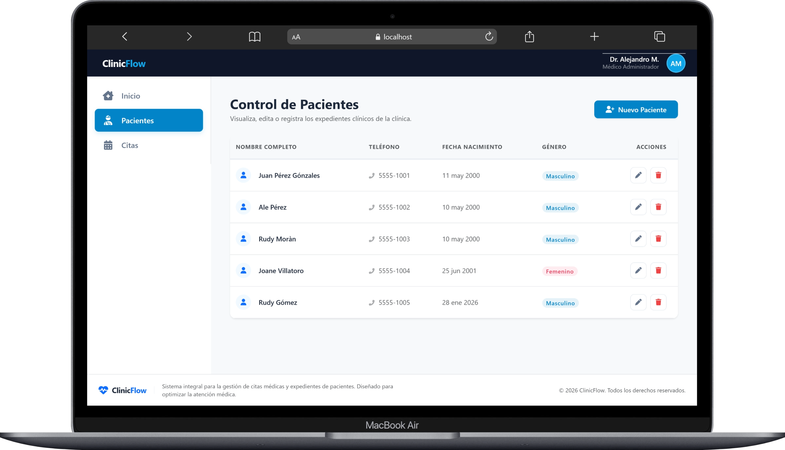

# ClinicFlow

Sistema web de gestión clínica desarrollado con Angular, Node.js, Express y MySQL.

ClinicFlow permite administrar pacientes y citas médicas mediante operaciones CRUD completas, utilizando una arquitectura frontend/backend desacoplada y base de datos relacional.

---

##  Capturas del sistema

### Dashboard

<p align="center">
  
</p>

### Pacientes

<p align="center">
  
</p>

### Formulario de Pacientes

<p align="center">
  
</p>

### Citas

<p align="center">
  
</p>

### Formulario de Citas

<p align="center">
  
</p>

---

##  Tecnologías utilizadas

### Frontend
- Angular
- TypeScript
- Bootstrap 5
- RxJS
- Angular Router
- sweetalert2

### Backend
- Node.js
- Express.js
- Sequelize ORM
- MySQL

---

##  Funcionalidades

- CRUD de pacientes
- CRUD de citas
- Relación entre pacientes y citas
- Validaciones en formularios
- Consumo de API REST
- Arquitectura organizada por módulos

---

##  Estructura del proyecto

```bash
ClinicFlow/
│
├── backend/
│   ├── src/
│   │   ├── config/
│   │   ├── controllers/
│   │   ├── models/
│   │   └── routes/
│
├── frontend/
│   ├── src/
│   │   ├── app/
│   │   │   ├── components/
│   │   │   ├── models/
│   │   │   ├── pages/
│   │   │   └── services/
```

---

##  Instalación

### Clonar repositorio

```bash
git clone TU_REPOSITORIO
```

---

### Backend

```bash
cd backend
npm install
npm run dev
```

Servidor:

```bash
http://localhost:3000
```

---

### Frontend

```bash
cd frontend
npm install
ng serve
```

Aplicación:

```bash
http://localhost:4200
```

---

## 📌 Estado del proyecto

- CRUD funcional de pacientes y citas
- Arquitectura frontend/backend separada
- Base de datos relacional con MySQL
- Pendiente despliegue en nube

---

##  Autor

### Rudy Isaías Morán Gómez

Desarrollador web enfocado en Angular, Node.js y MySQL.